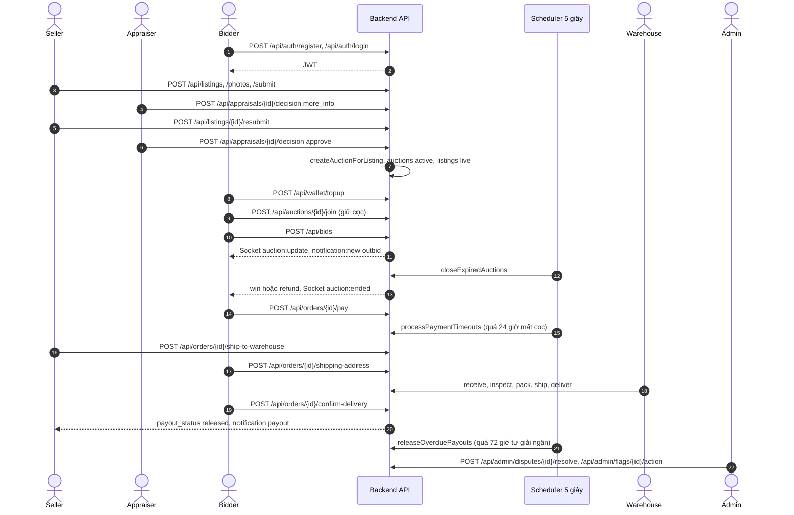
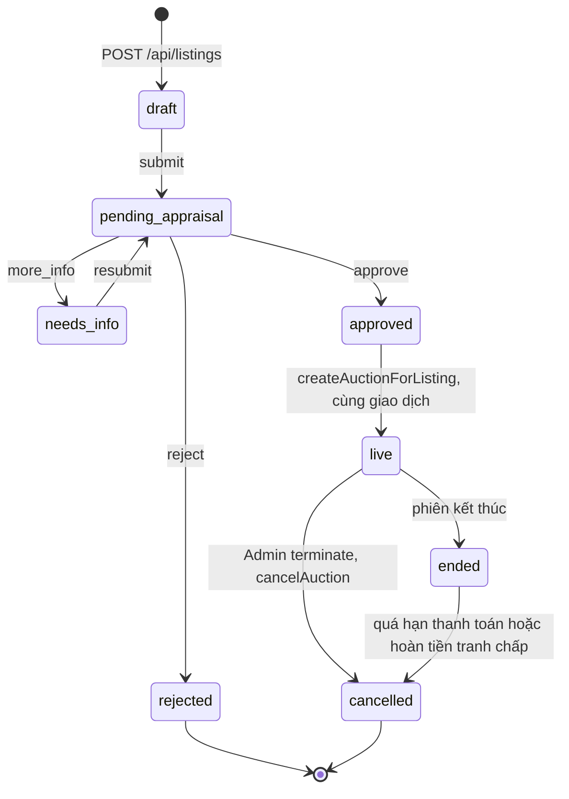
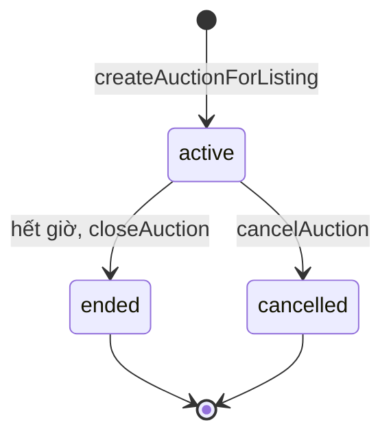
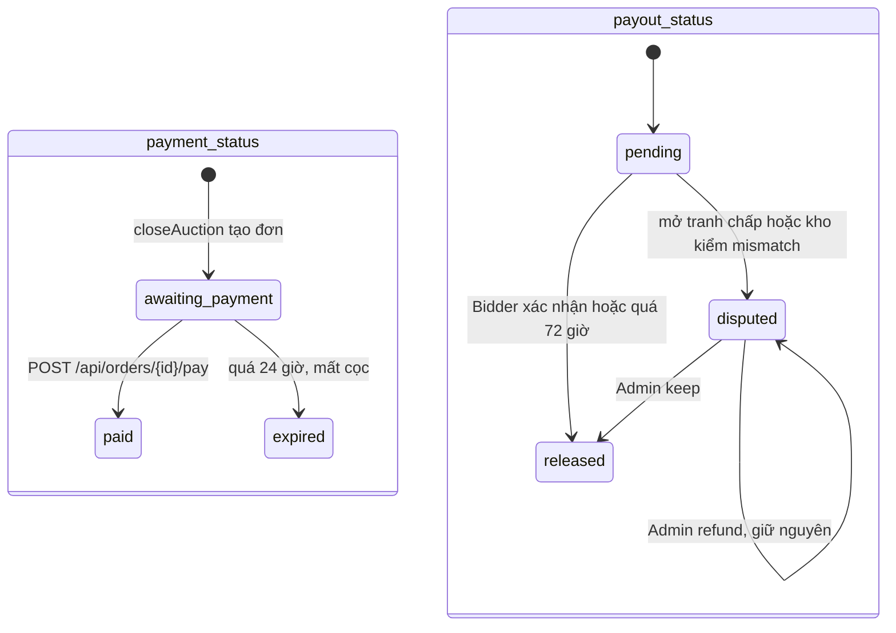
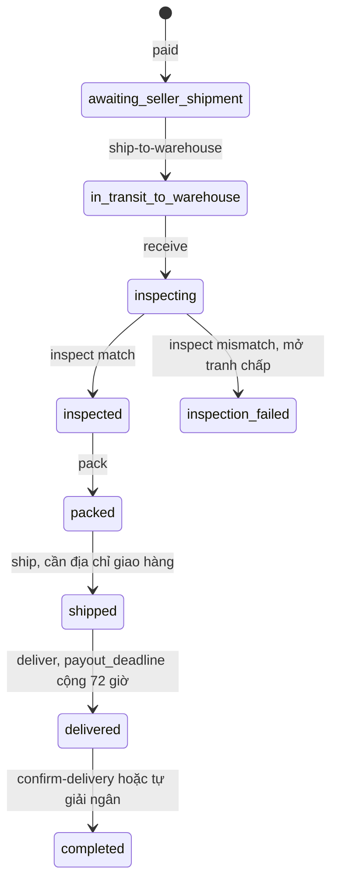

# Luồng chính của BidVibe

Tài liệu này mô tả luồng nghiệp vụ từ lúc đăng ký đến lúc giải ngân, **dựa trên code backend và schema đang có** (migration 001–006). Mỗi bước có nhãn trạng thái triển khai:

- **[Đã có]** route đã đăng ký trong `src/routes/index.js`, có logic xử lý thật và đã chạy qua kiểm thử end-to-end (`npm test`, kết quả ở [`test-be2.md`](test-be2.md)).
- **[Một phần]** mới làm được một phần.
- **[Chưa có]** chưa có code.

Định dạng phản hồi của mọi API: `{ success, data, error }`. Mọi route trừ `/api/health` và `/api/auth/*` cần header `Authorization: Bearer <token>`. Chi tiết từng endpoint: BE2 ở [`api.md`](api.md), BE1 ở [`api_be1.md`](api_be1.md).

## 1. Tổng quan

BidVibe là sàn đấu giá trực tuyến theo thời gian thực cho đồ cũ và đồ sưu tầm (đồ án FPT University). Mọi món hàng đều được thẩm định trước khi lên sàn, và đi qua kho của BidVibe để kiểm tra trước khi tới tay người mua. Tiền của người mua được nền tảng giữ (ký quỹ) cho tới khi người mua xác nhận đã nhận đúng hàng.

| Vai trò | Bảng tài khoản | Làm gì |
|---|---|---|
| Bidder (người mua) | `accounts` + `bidders` | Nạp ví, đặt cọc tham gia phiên, trả giá, thanh toán đơn thắng, chọn địa chỉ giao hàng, xác nhận nhận hàng, mở tranh chấp |
| Seller (người bán) | `accounts` + `sellers` | Đăng tin ký gửi, bổ sung hồ sơ khi được yêu cầu, gửi hàng về kho, nhận giải ngân |
| Appraiser (thẩm định) | `ops_accounts` (`role = 'appraiser'`) | Duyệt / từ chối / yêu cầu bổ sung tin đăng |
| Warehouse (kho vận) | `ops_accounts` (`role = 'warehouse'`) | Nhận hàng, kiểm, đóng gói, gửi đi, báo sai lệch |
| Admin | `ops_accounts` (`role = 'admin'`) | Xử lý phiên bị gắn cờ, phán quyết tranh chấp, quản lý tài khoản, xem báo cáo |

Một tài khoản `accounts` chỉ là Bidder **hoặc** Seller, không cả hai (trigger `enforce_single_role` trong migration 001). Chỉ Bidder có ví (`bidders.wallet_balance`, `bidders.wallet_held`).

## 2. Luồng chính, từng bước

### Bước 1 — Đăng ký và đăng nhập [Đã có]

| | |
|---|---|
| Ai | Bidder, Seller (đăng ký + đăng nhập); Appraiser / Warehouse / Admin (chỉ đăng nhập, tài khoản do Admin tạo qua `POST /api/admin/ops-accounts`) |
| Endpoint | `POST /api/auth/register`, `POST /api/auth/login`, `POST /api/auth/ops/login`, `GET /api/me` |
| Code | `routes/auth.routes.js`, `services/auth_service.js`, `middleware/auth.js`, `utils/validate.js` |
| Bảng | Ghi `accounts` (`email`, `password_hash` băm bcrypt) + một dòng `bidders` hoặc `sellers`. Đăng nhập đọc `accounts` / `ops_accounts` (`password_hash`, `status`) |
| Kiểm tra đầu vào | Email đúng định dạng, mật khẩu 6–72 ký tự, họ tên không rỗng, vai trò chỉ `bidder` / `seller` |
| Giao dịch | Có: đăng ký tạo `accounts` + bảng con trong một giao dịch |
| Kết quả | JWT 7 ngày, payload `{ sub, kind: 'account' \| 'ops', role }`. Mỗi request, `requireAuth` kiểm tra lại `status` trong DB: tài khoản bị khoá trả `403 ACCOUNT_SUSPENDED` dù token còn hạn |

### Bước 2 — Seller đăng tin ký gửi [Đã có]

| | |
|---|---|
| Ai | Seller |
| Endpoint | `POST /api/listings`, `PATCH /api/listings/:id`, `POST /api/listings/:id/photos`, `POST /api/listings/:id/submit`, `GET /api/listings/mine`, `GET /api/categories`, `POST /api/ai/suggest-price` |
| Code | `services/listing_service.js`, `services/ai_price_suggestion.js` |
| Bảng | Ghi `listings` (`seller_id`, `category_id`, `title`, `starting_price`, `duration_hours`, `ai_suggested_price`, `status`), `listing_photos` (`url`, `order_index`, tối đa 10 ảnh) |
| Trạng thái | Tạo: `draft`. Gửi thẩm định: `draft` → `pending_appraisal` (cần ít nhất 1 ảnh). Chỉ sửa / thêm ảnh khi `draft` hoặc `needs_info`, sai thì `409 INVALID_STATE` |
| Giao dịch | Sửa, thêm ảnh, gửi thẩm định đều khoá dòng `listings` (`FOR UPDATE`) trong một giao dịch |
| Ghi chú | Ảnh chỉ lưu URL. Gợi ý giá dùng lịch sử phiên cùng danh mục (`listEndedHistory` của BE1), thiếu dữ liệu thì dùng khung giá soạn sẵn; chưa gọi mô hình AI |

### Bước 3 — Thẩm định: duyệt, từ chối, yêu cầu bổ sung [Đã có]

| | |
|---|---|
| Ai | Appraiser |
| Endpoint | `GET /api/appraisals/queue`, `GET /api/appraisals/:listingId`, `POST /api/appraisals/:listingId/decision` |
| Code | `services/appraisal_service.js` |
| Bảng | Mỗi quyết định thêm **một dòng mới** vào `appraisals` (`listing_id`, `appraiser_id`, `decision`, `reason`), không sửa dòng cũ |
| Trạng thái | Chỉ quyết định khi tin đang `pending_appraisal`: `reject` → `rejected`; `more_info` → `needs_info`; `approve` → sang bước 4. Sai thứ tự → `409 INVALID_STATE` |
| Vòng lặp bổ sung | Seller sửa / thêm ảnh rồi `POST /api/listings/:id/resubmit`: `needs_info` → `pending_appraisal`; Thẩm định quyết định tiếp, sinh thêm một dòng `appraisals` |
| Thông báo | Seller nhận `listing_approved` / `listing_rejected` / `listing_needs_info` (sau COMMIT) |
| Giao dịch | Có: khoá `listings`, ghi `appraisals`, đổi trạng thái, tạo phiên (nếu duyệt), ghi thông báo trong một giao dịch |

### Bước 4 — Tạo phiên đấu giá [Đã có]

| | |
|---|---|
| Ai | Hệ thống, ngay khi Appraiser duyệt |
| Hàm | BE2 đặt `listings.status = 'approved'` rồi gọi `auction_engine.createAuctionForListing(client, listingId)` (BE1) **trong cùng giao dịch** của bước 3 |
| Bảng | Ghi `auctions` (`current_price = starting_price`, `bid_step = 50.000`, `deposit_required` = 10 phần trăm giá khởi điểm làm tròn nghìn, `starts_at = now`, `ends_at = starts_at + duration_hours`) |
| Trạng thái | `listings`: `approved` → `live` (do hàm BE1). `auctions.status = 'active'` |

### Bước 5 — Bidder nạp ví, đặt cọc, trả giá [Đã có]

**5a. Nạp ví** — `POST /api/wallet/topup` `{ amount }` (1 đến 100.000.000đ, cổng giả lập luôn thành công). Ghi `bidders.wallet_balance` + một dòng `wallet_transactions` loại `topup`. Có giao dịch.

**5b. Xem phiên** — `GET /api/auctions` (lọc `status=live|ended|joined`, `category`, `q`, `sort`) và `GET /api/auctions/:id` (kèm 20 lượt giá gần nhất, tên bị che dạng `A***`).

**5c. Đặt cọc** — `POST /api/auctions/:id/join` (chỉ `bidder`). Khoá dòng `auctions`, ghi `auction_deposits` (`status = 'held'`, mỗi người một lần mỗi phiên), chuyển `wallet_balance` → `wallet_held` (giao dịch ví `deposit_hold`). Không đủ tiền → `402 INSUFFICIENT_FUNDS`.

**5d. Trả giá** — `POST /api/bids` `{ auctionId, amount }` hoặc `{ auctionId, increment }` (đúng một trong hai). Khoá dòng `auctions`; với `increment`, giá hiện tại được đọc **sau khi khoá** nên hai người gửi cùng lúc nhận hai mức giá liên tiếp, không trùng; phải đã cọc (`DEPOSIT_REQUIRED`), không tự vượt giá mình (`ALREADY_LEADING`), `amount >= current_price + bid_step` (`BID_TOO_LOW`). Ghi `bids`, cập nhật `current_price`, `bid_count`. Đặt trong 30 giây cuối thì `ends_at` = lúc đặt + 30 giây. Thông báo `outbid` cho người bị vượt; sau COMMIT đẩy Socket.io `auction:update` và `notification:new` (tên sự kiện và dữ liệu: [`socket.md`](socket.md)); `fraud_detection.scanAuction` chạy nền.

### Bước 6 — Phiên kết thúc, chọn người thắng [Đã có]

| | |
|---|---|
| Ai | Tiến trình nền (`services/scheduler.js`, 5 giây một lần) gọi `closeExpiredAuctions()` (BE1) |
| Không có lượt giá | `auctions.status` → `ended`, `listings.status` → `ended`, không tạo đơn |
| Có người thắng | `auctions.status` → `ended`, `winner_id`; `listings.status` → `ended`; tạo `orders` (`payment_status = 'awaiting_payment'`, `payment_deadline = now + 24 giờ`, `payout_status = 'pending'`) |
| Cọc | Người thắng: `applied_to_payment` (vẫn nằm trong `wallet_held`). Người thua: `released`, hoàn về ví (`deposit_release`) |
| Thông báo | `win`, `refund`, `sold`; Socket.io `auction:ended` |
| Giao dịch | Một giao dịch mỗi phiên, `FOR UPDATE SKIP LOCKED` |

### Bước 7 — Thanh toán trong 24 giờ, quá hạn mất cọc [Đã có]

- **Xem đơn** — `GET /api/orders/mine`, `GET /api/orders/:id` (BE1). Tổng = giá chốt + phí 5 phần trăm (làm tròn nghìn) + vận chuyển 40.000đ, cọc được trừ.
- **Thanh toán** — `POST /api/orders/:id/pay` `{ method: 'wallet' | 'qr' | 'card' }`. `payment_status`: `awaiting_payment` → `paid`; cọc rời `wallet_held`, giao dịch ví `payment`. Tiền nằm trong ký quỹ nền tảng (`payout_status = 'pending'`).
- **Quá hạn** — scheduler gọi `processPaymentTimeouts()`: `payment_status` → `expired`, `listings.status` → `cancelled`, cọc `forfeited` (giao dịch ví `deposit_forfeit`), thông báo `warn`.

### Bước 8 — Seller gửi hàng về kho [Đã có]

| | |
|---|---|
| Ai | Seller |
| Endpoint | `GET /api/orders/selling`, `POST /api/orders/:id/ship-to-warehouse` |
| Code | `services/fulfilment_service.js` |
| Bảng | Tạo `warehouse_receipts` (`order_id`, `order_code` dạng `BV-ddmmyy-<id>`) với `received_at = NULL` nghĩa là "đang trên đường về kho" (schema không có cột riêng cho việc này) |
| Điều kiện | Đơn của mình, `payment_status = 'paid'`, chưa báo gửi, không có tranh chấp; sai → `409` |
| Thông báo | Người mua: "Người bán đã gửi hàng đến kho" |
| Giao dịch | Có, khoá dòng `orders` |

### Bước 8b — Bidder chọn địa chỉ giao hàng [Đã có]

| | |
|---|---|
| Ai | Bidder |
| Endpoint | `GET/POST /api/addresses`, `PATCH/DELETE /api/addresses/:id`, `POST /api/addresses/:id/default`, `POST /api/orders/:id/shipping-address` `{ addressId }` |
| Code | `services/address_service.js`, `fulfilment_service.setShippingAddress` |
| Bảng | `addresses` (migration 005: `recipient_name`, `phone`, `address_line`, `ward`, `district`, `city`, `is_default`, `deleted_at`); `orders.shipping_address_id` |
| Khi nào | Bất kỳ lúc nào từ khi có đơn (kể cả lúc chờ thanh toán) tới trước bước `ship` của kho; sau đó `409 ALREADY_SHIPPED` |
| Quyền | Chỉ chủ đơn, chỉ địa chỉ của chính mình (khác → `404`) |
| Lịch sử | Xoá là xoá mềm; sửa địa chỉ mà đơn đã gửi đang dùng thì tạo bản mới, đơn đã gửi giữ nguyên địa chỉ cũ |

Luồng thanh toán của BE1 (`POST /api/orders/:id/pay`) không đổi; địa chỉ được chọn qua API riêng của BE2. Kho và người mua thấy địa chỉ trong `GET /api/warehouse/orders` và `GET /api/orders/:id/tracking`; người bán không thấy.

### Bước 9 — Kho nhận, kiểm, đóng gói, gửi, giao [Đã có]

Endpoint chung: `GET /api/warehouse/orders?stage=` và `POST /api/warehouse/orders/:id/<bước>` (vai trò `warehouse`). Mỗi bước khoá dòng `orders` trong một giao dịch; sai thứ tự → `409 INVALID_STATE`.

| Bước | Điều kiện | Ghi gì | Thông báo |
|---|---|---|---|
| `receive` | Seller đã báo gửi, chưa nhận | `warehouse_receipts.received_at = now` | Người mua |
| `inspect` `{ result, notes }` | Đã nhận, chưa kiểm | `inspection_result` (`match` / `mismatch`), `inspection_notes`, `inspected_by` | Có khi `mismatch` |
| `pack` | Kiểm `match`, không tranh chấp | `shipments` (`status = 'packing'`) + `shipment_events` | — |
| `ship` `{ carrier, trackingCode }` | `packing`, **đơn đã có địa chỉ giao hàng** (chưa có → `409 ORDER_NO_ADDRESS`) | `shipments.status` → `shipped`, `tracking_code` + `shipment_events` | Người mua |
| `deliver` | `shipped` | `shipments.status` → `delivered` + `shipment_events`; `orders.payout_deadline = now + 72 giờ` | Người mua |

Kiểm `mismatch` (bắt buộc ghi chú): tự mở `disputes` (`source = 'warehouse'`, `reporter_id = NULL`, `escrow_amount` = số người mua đã trả), ghi 2 dòng `dispute_timeline`, `orders.payout_status` → `disputed`, thông báo cả hai bên. Đơn dừng ở bước kho cho tới khi Admin xử lý.

### Bước 10 — Bidder xác nhận đã nhận hàng [Đã có]

`POST /api/orders/:id/confirm-delivery` (vai trò `bidder`, chỉ đơn của mình). Điều kiện: `shipments.status = 'delivered'`, chưa xác nhận, `payout_status = 'pending'` (đang tranh chấp → `409 DISPUTE_OPEN`). Ghi `orders.delivered_confirmed_at = now` rồi giải ngân ngay (bước 11) trong cùng giao dịch. Người mua / người bán xem tiến trình qua `GET /api/orders/:id/tracking`.

### Bước 11 — Giải ngân cho Seller [Đã có]

| Cách | Điều kiện | Kết quả |
|---|---|---|
| Thủ công | Bidder xác nhận (bước 10) | `payout_status`: `pending` → `released`; Seller nhận thông báo `payout` |
| Tự động | `payout_status = 'pending'`, quá `payout_deadline` (giao + 72 giờ), chưa xác nhận | `payout_service.releaseOverduePayouts()` chạy trong vòng 5 giây của `scheduler.js`, khoá `FOR UPDATE SKIP LOCKED`; đổi `released`, thông báo cả hai bên. Tắt bằng `AUTO_PAYOUT_ENABLED=false` |

Quyết định đã chốt: **Seller chưa có ví**, giải ngân chỉ đổi `payout_status`, không có dòng tiền nào ghi cho Seller.

### Bước 12 — Tranh chấp và Admin xử lý [Đã có]

| | |
|---|---|
| Ai mở | Bidder hoặc Seller qua `POST /api/disputes` `{ orderId, title, reason }` (chỉ đơn của mình, đã `paid`, chưa giải ngân, chưa có tranh chấp); Kho tự mở khi kiểm `mismatch` |
| Bảng | `disputes` (`source`, `reporter_id`, `escrow_amount`, `status = 'open'`), 2 dòng `dispute_timeline`; `orders.payout_status` → `disputed` |
| Admin xem | `GET /api/admin/disputes?status=open` (kèm timeline, người mua, người bán) |
| Admin phán quyết | `POST /api/admin/disputes/:id/resolve` `{ resolution, note? }` |
| `refund` | Gọi `wallet_service.refund(client, …)` (BE1) cộng `escrow_amount` về ví người mua (giao dịch ví `refund`); tin đăng → `cancelled`; `payout_status` giữ `disputed` |
| `keep` | `payout_status` → `released` (trừ khi đơn còn tranh chấp khác đang mở) |
| Chung | `disputes.status` → `resolved`, `resolution`, `resolved_by`; thêm dòng timeline; thông báo cả hai bên. Phán quyết lần hai → `409 ALREADY_RESOLVED` |
| Giao dịch | Có, khoá `disputes` và `orders` |

### Bước 13 — Phiên bị gắn cờ và Admin hành động [Đã có]

| Việc | Hiện trạng |
|---|---|
| Phát hiện | `fraud_detection.scanAuction` (BE1) chạy sau mỗi lượt giá, theo 4 luật (hai tài khoản đặt xen kẽ, dồn dập từ 5 lượt trong 60 giây, nhảy giá từ 3 lần, tài khoản mới đặt giá cao). Ghi `flagged_auctions` (`pending`) + `flag_evidence`. Kiểm tra trùng và ghi cờ nằm chung một giao dịch, tuần tự theo phiên (advisory lock); unique index `uq_flagged_auctions_pending_reason` (migration 006) chặn hai cờ `pending` cùng lý do |
| Admin xem | `GET /api/admin/flags?status=` |
| Hành động | `POST /api/admin/flags/:id/action` `{ action, reason }` |
| `pause` | Cờ → `paused`. Phiên không nhận cọc / lượt giá mới, không bị đóng tự động, **đồng hồ đóng băng**: trigger `flagged_auctions_sync_pause` (migration 006, BE1) ghi `auctions.paused_at`. Thông báo Seller |
| `verify` / `safe` | Cờ → `verify` / `safe`; nếu không còn cờ `paused` nào thì phiên chạy lại và trigger cộng thời gian đã dừng vào `ends_at` (phiên còn đúng thời gian như lúc bị dừng) |
| `terminate` | Bắt buộc lý do. Gọi `cancelAuction(client, …)` (BE1): phiên → `cancelled`, tin → `cancelled`, hoàn cọc mọi người, thông báo; cờ → `terminated` |
| Người dùng báo cáo phiên | **[Đã có]** `POST /api/auctions/:id/report` `{ reason, note? }` (bidder, BE1). Mỗi người một lần mỗi phiên (`409 ALREADY_REPORTED`). Phiên có cờ `pending` thì thêm `flag_evidence` vào cờ đó, chưa có thì tạo cờ `low`. Admin xử lý như cờ AI |

Cờ đã `terminated` / `safe` không đổi nữa (`409`).

### Ngoài luồng chính [Đã có]

- **Admin**: `GET /api/admin/dashboard`, `GET /api/admin/report/weekly` (7 ngày, từ dữ liệu thật), quản lý tài khoản ops (`GET/POST/PATCH /api/admin/ops-accounts`, mật khẩu bcrypt) và khoá / mở khoá Bidder, Seller (`GET/PATCH /api/admin/accounts`).
- **Chatbot**: `POST /api/chat/messages`, `GET /api/chat/sessions/:id/messages`; ghi `chat_sessions`, `chat_messages`; trả lời soạn sẵn theo từ khoá.
- **Thông báo**: `GET /api/notifications`, `POST /api/notifications/:id/read`.

## 3. Sơ đồ

### 3a. Sơ đồ tuần tự luồng chính

### 3b. Trạng thái tin đăng (`listings.status`)

### 3c. Trạng thái phiên (`auctions.status`)

Cờ `paused` trên `flagged_auctions` không đổi `auctions.status`; nó chặn đặt giá, chặn đóng phiên tự động và đóng băng đồng hồ (`auctions.paused_at`; tiếp tục thì `ends_at` cộng thêm thời gian đã dừng).

### 3d. Trạng thái đơn hàng (`orders`)

### 3e. Giai đoạn kho của một đơn đã thanh toán

## 4. Luồng tiền

Mọi thay đổi số dư đi qua `services/wallet_service.js` (BE1). Mỗi hàm nhận `client` của giao dịch nơi gọi, đổi số dư bằng **một câu `UPDATE` có điều kiện không âm**, rồi ghi **đúng một dòng `wallet_transactions`** với `balance_after` là số dư sau thay đổi. Kiểm thử BE2 xác nhận `balance_after` của dòng cuối luôn bằng `wallet_balance`.

| Hàm | Ai gọi, khi nào | `wallet_balance` | `wallet_held` | `kind` |
|---|---|---|---|---|
| `topUp` | Bidder nạp ví | + số tiền | | `topup` |
| `holdDeposit` | Đặt cọc tham gia | − cọc | + cọc | `deposit_hold` |
| `releaseDeposit` | Thua phiên / phiên bị huỷ | + cọc | − cọc | `deposit_release` |
| `forfeitDeposit` | Quá hạn thanh toán 24 giờ | | − cọc | `deposit_forfeit` |
| `payOrder` | Thanh toán đơn thắng | − phần còn lại (chỉ khi trả bằng ví) | − cọc | `payment` (số tiền = tổng phải trả) |
| `refund` | BE2: Admin hoàn tiền tranh chấp | + `escrow_amount` | | `refund` |

Quy tắc tính tiền (`auction_engine.js`): cọc = 10 phần trăm giá khởi điểm, làm tròn nghìn; tổng phải trả = giá chốt + phí 5 phần trăm (làm tròn nghìn) + vận chuyển 40.000đ, cọc trừ vào tổng. Người thắng chưa thanh toán: cọc `applied_to_payment` nhưng vẫn nằm trong `wallet_held`.

`disputes.escrow_amount` = số tiền người mua đã trả cho đơn (lấy từ dòng `wallet_transactions` loại `payment`). `escrowHeld` trên bảng điều khiển Admin = tổng số đã trả của các đơn chưa giải ngân và chưa hoàn.

Giới hạn hiện tại:
- **Seller chưa có ví.** Giải ngân chỉ đổi `orders.payout_status`; tiền coi như chuyển cho Seller ngoài hệ thống.
- Hoàn tiền trả **toàn bộ** số đã trả về ví BidVibe của người mua, kể cả phần người mua trả qua QR / thẻ.
- Nạp ví và thanh toán QR / thẻ là cổng giả lập, luôn thành công.
- Phí 5 phần trăm và vận chuyển 40.000đ là hằng số trong code, không lưu trong `orders`.

## 5. Luồng thời gian

| Mốc | Giá trị | Nằm ở | Trạng thái |
|---|---|---|---|
| Thời lượng phiên | `listings.duration_hours` (1–336 giờ) | `createAuctionForListing` (BE1) | Có |
| Chống chốt phút chót | Đặt giá khi còn ≤ 30 giây thì `ends_at` = lúc đặt + 30 giây | `SNIPE_WINDOW_MS`, `auction_engine.js` | Có |
| Quét phiên hết giờ | Mỗi 5 giây, bỏ qua phiên đang tạm dừng | `scheduler.js` → `closeExpiredAuctions` (BE1) | Có |
| Tạm dừng phiên | Đồng hồ đứng yên; tiếp tục thì `ends_at` += thời gian đã dừng | Trigger `sync_auction_pause` (migration 006), `auctions.paused_at` | Có |
| Hạn thanh toán | Lúc thắng + 24 giờ | `PAYMENT_WINDOW_MS`, `auction_engine.js` | Có |
| Quét đơn quá hạn thanh toán | Mỗi 5 giây | `scheduler.js` → `processPaymentTimeouts` (BE1) | Có |
| Hạn tự giải ngân | Lúc giao + 72 giờ (`orders.payout_deadline`) | `PAYOUT_WINDOW_HOURS`, `fulfilment_service.js` | Có |
| Quét đơn quá hạn giải ngân | Mỗi 5 giây | `scheduler.js` → `payout_service.releaseOverduePayouts` (BE2) | Có, tắt bằng `AUTO_PAYOUT_ENABLED=false` |
| Hạn token đăng nhập | 7 ngày | `TOKEN_TTL`, `auth_service.js` | Có |

Scheduler chỉ khởi động khi chạy server trực tiếp (`npm start` / `npm run dev`); chạy script hoặc test thì không có tiến trình nền. Nhiều máy cùng chạy server trên database dùng chung thì khoá `FOR UPDATE SKIP LOCKED` ngăn xử lý trùng.

## 6. Phân chia BE1 và BE2 trên luồng

| Bước | Chủ sở hữu | File chính |
|---|---|---|
| 1. Đăng ký, đăng nhập, JWT | BE2 | `auth_service.js`, `middleware/auth.js` |
| 2–3. Đăng tin, thẩm định, gợi ý giá | BE2 | `listing_service.js`, `appraisal_service.js`, `ai_price_suggestion.js` |
| 4. Tạo phiên | BE1 (BE2 gọi) | `createAuctionForListing` |
| 5–7. Ví, cọc, đặt giá, đóng phiên, thanh toán, quá hạn | BE1 | `auction_engine.js`, `wallet_service.js`, `scheduler.js` |
| 8–11. Gửi kho, địa chỉ giao hàng, kho vận, xác nhận, giải ngân | BE2 | `fulfilment_service.js`, `address_service.js`, `payout_service.js` |
| 12. Tranh chấp | BE2 (gọi `refund` của BE1) | `dispute_service.js` |
| 13. Gắn cờ | BE1 phát hiện, BE2 (Admin) xử lý | `fraud_detection.js`, `admin_service.js` |
| Thông báo, chatbot, Admin | BE2 | `notification_service.js`, `chat_service.js`, `admin_service.js` |

Điểm tiếp giáp:

| Hàm | Cung cấp | Nơi gọi |
|---|---|---|
| `createAuctionForListing(client, listingId)` | BE1 | `appraisal_service.decide` (duyệt) |
| `cancelAuction(client, auctionId, { reason })` → `.emit()` sau COMMIT | BE1 | `admin_service.flagAction` (terminate) |
| `wallet_service.refund(client, { bidderId, amount, auctionId })` | BE1 | `dispute_service.resolve` (refund) |
| `inTransaction(fn)` | BE1 | Mọi service BE2 có giao dịch |
| `auction.model.listEndedHistory({ categoryCode })` | BE1 | `ai_price_suggestion.suggestPrice` |
| `createNotification`, `emitNotification`, `notify` | BE2 | BE1 (outbid, win, refund, sold, warn) và BE2 |
| `payout_service.releaseOverduePayouts()` | BE2 | `scheduler.js` của BE1 (3 dòng thêm vào vòng `tick`) |

## 7. Còn thiếu và việc tiếp theo

Các mục "Chặn luồng chính" trong lần quét trước đều đã có. Còn lại:

### Nên có

| # | Việc | Chủ |
|---|---|---|
| 1 | ~~Tạm dừng chưa "đóng băng" đồng hồ~~ — **xong** (migration 006, trigger `sync_auction_pause`) | BE1 |
| 2 | Socket.io: `auction_socket.js` chỉ xác thực JWT lúc kết nối, chưa chặn / ngắt tài khoản bị khoá như `requireAuth` | BE1 |
| 3 | Kiểm thử chạy trên database dùng chung. Đã giảm rủi ro: dữ liệu test có tiền tố `test_be1_` / `test_be2_`, chỉ dọn đúng dòng của mình (README). Vẫn nên có database riêng cho test hoặc CI | BE1, BE2 |
| 3b | Không có sự kiện socket khi Admin tạm dừng / tiếp tục phiên; app người mua phải tải lại chi tiết phiên (xem `socket.md` mục 6) | BE1 |

Đã xử lý thêm ở BE1: chống trùng khi nhiều lượt giá đến cùng lúc (cờ gian lận trong giao dịch + unique index; `increment` đọc giá sau khi khoá); chốt tên sự kiện Socket.io ([`socket.md`](socket.md)).

### Có thì tốt

| # | Việc | Chủ |
|---|---|---|
| 4 | ~~Người dùng tự báo cáo phiên đáng ngờ~~ — **xong** (`POST /api/auctions/:id/report`) | BE1 |
| 5 | Ví Seller và dòng tiền giải ngân thật; hoàn tiền phần trả qua QR / thẻ về đúng kênh | BE1, BE2 |
| 6 | Gợi ý giá, chatbot, báo cáo gọi mô hình AI thật | BE2 |
| 7 | Giới hạn số lần thử đăng nhập | BE2 |
