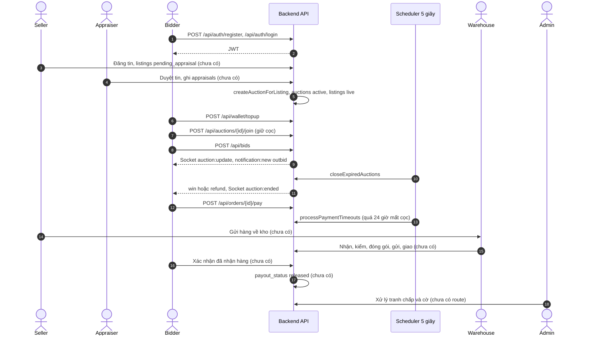
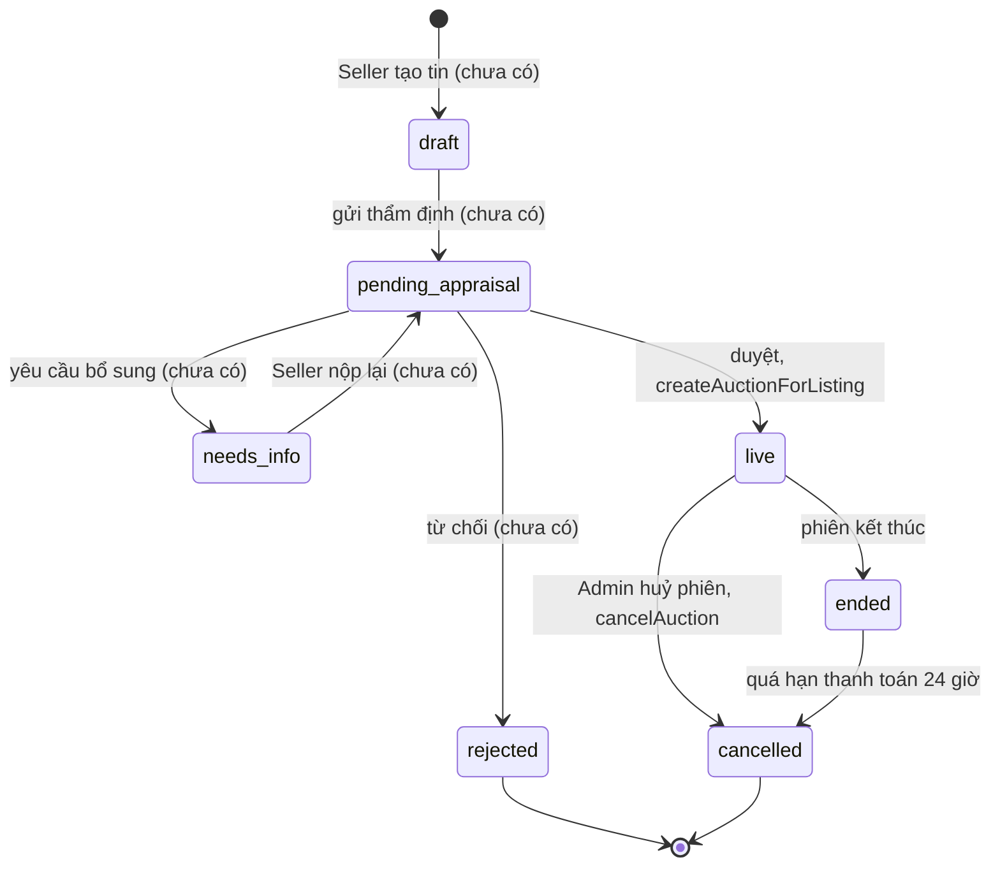
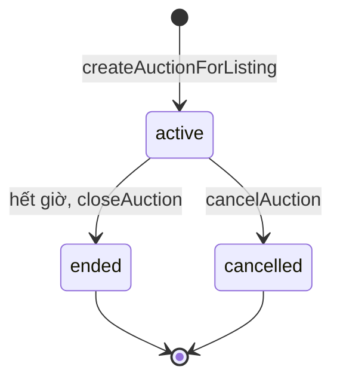
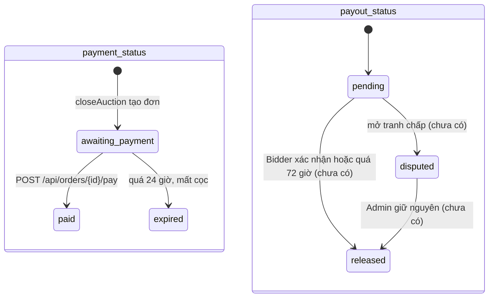

# Luồng chính của BidVibe

Tài liệu này mô tả luồng nghiệp vụ từ lúc đăng ký đến lúc giải ngân, **dựa trên code backend và schema đang có** (nhánh `develop`, migration 001–004). Mỗi bước có nhãn trạng thái triển khai:

- **[Đã có]** route đã đăng ký trong `src/routes/index.js` và có logic xử lý thật.
- **[Một phần]** có hàm/dữ liệu nền nhưng chưa có route, hoặc mới làm được một nửa.
- **[Chưa có]** chưa có code; tên endpoint (nếu có ghi) chỉ là đề xuất, không tồn tại trong code.

Định dạng phản hồi của mọi API: `{ success, data, error }` (xem `docs/architecture.md`). Mọi route trừ `/api/health` và `/api/auth/*` cần header `Authorization: Bearer <token>`.

## 1. Tổng quan

BidVibe là sàn đấu giá trực tuyến theo thời gian thực cho đồ cũ và đồ sưu tầm (đồ án FPT University). Mọi món hàng đều được thẩm định trước khi lên sàn, và đi qua kho của BidVibe để kiểm tra trước khi tới tay người mua. Tiền của người mua được nền tảng giữ (ký quỹ) cho tới khi người mua xác nhận đã nhận đúng hàng.

| Vai trò | Bảng tài khoản | Làm gì |
|---|---|---|
| Bidder (người mua) | `accounts` + `bidders` | Nạp ví, đặt cọc tham gia phiên, trả giá, thanh toán đơn thắng, xác nhận nhận hàng, mở tranh chấp |
| Seller (người bán) | `accounts` + `sellers` | Đăng tin ký gửi, bổ sung hồ sơ khi được yêu cầu, gửi hàng về kho, nhận giải ngân |
| Appraiser (thẩm định) | `ops_accounts` (`role = 'appraiser'`) | Duyệt / từ chối / yêu cầu bổ sung tin đăng |
| Warehouse (kho vận) | `ops_accounts` (`role = 'warehouse'`) | Nhận hàng, kiểm, đóng gói, gửi đi, báo sai lệch |
| Admin | `ops_accounts` (`role = 'admin'`) | Xử lý phiên bị gắn cờ, phán quyết tranh chấp, quản lý tài khoản |

Một tài khoản `accounts` chỉ là Bidder **hoặc** Seller, không cả hai (trigger `enforce_single_role` trong migration 001). Chỉ Bidder có ví (`bidders.wallet_balance`, `bidders.wallet_held`).

## 2. Luồng chính, từng bước

### Bước 1 — Đăng ký và đăng nhập [Đã có]

| | |
|---|---|
| Ai | Bidder, Seller (đăng ký + đăng nhập); Appraiser / Warehouse / Admin (chỉ đăng nhập, tài khoản do hệ thống cấp) |
| Endpoint | `POST /api/auth/register`, `POST /api/auth/login`, `POST /api/auth/ops/login`, `GET /api/me` |
| Code | `src/routes/auth.routes.js`, `src/services/auth_service.js`, `src/middleware/auth.js` |
| Bảng | Ghi `accounts` (`email`, `password_hash` băm bcrypt) + một dòng `bidders` hoặc `sellers`. Đăng nhập đọc `accounts.status` / `ops_accounts.status`, chỉ `active` mới vào được |
| Trạng thái | Tài khoản mới: `accounts.status = 'active'` |
| Giao dịch | Có: đăng ký tạo `accounts` + bảng con trong một `BEGIN/COMMIT` |
| Kết quả | JWT 7 ngày, payload `{ sub, kind: 'account' \| 'ops', role }`; middleware gắn `req.user = { id, kind, role }` |

Lưu ý: chưa kiểm tra độ dài mật khẩu và định dạng email (đã thử: mật khẩu 1 ký tự vẫn đăng ký được).

### Bước 2 — Seller đăng tin ký gửi [Chưa có]

| | |
|---|---|
| Ai | Seller |
| Endpoint | Chưa có route nào ghi `listings` |
| Bảng (theo schema) | `listings` (`seller_id`, `category_id`, `title`, `starting_price`, `duration_hours`, `ai_suggested_price`, `status`), `listing_photos` (`url`, `order_index`) |
| Trạng thái (theo schema) | `draft` → `pending_appraisal` khi gửi thẩm định |
| Ghi chú | Theo quyết định đã chốt: ảnh chỉ lưu URL; giá gợi ý AI là nội dung soạn sẵn, chưa gọi mô hình thật |

Hiện tin đăng chỉ được tạo bởi script seed (`scripts/seed_demo.js`, `scripts/seed.js`).

### Bước 3 — Thẩm định: duyệt, từ chối, yêu cầu bổ sung [Chưa có]

| | |
|---|---|
| Ai | Appraiser |
| Endpoint | Chưa có |
| Bảng (theo schema) | Ghi `appraisals` (`listing_id`, `appraiser_id`, `decision` ∈ `approve` / `reject` / `more_info`, `reason`). Mỗi lần quyết định là **một dòng mới**, không sửa dòng cũ |
| Trạng thái (theo schema) | `pending_appraisal` → `rejected` (từ chối), → `needs_info` (yêu cầu bổ sung), duyệt thì sang bước 4 |
| Vòng lặp bổ sung | Seller bổ sung rồi nộp lại: `needs_info` → `pending_appraisal`, Appraiser quyết định tiếp và sinh thêm một dòng `appraisals` |
| Giao dịch | Cần: duyệt phải ghi `appraisals` và gọi hàm tạo phiên của BE1 trong cùng một giao dịch |

Không có code nào đọc hoặc ghi bảng `appraisals`.

### Bước 4 — Tạo phiên đấu giá [Một phần]

| | |
|---|---|
| Ai | Hệ thống, ngay khi Appraiser duyệt |
| Hàm | `auction_engine.createAuctionForListing(client, listingId)` — **đã có** (BE1), nhưng chưa có route nào gọi vì bước 3 chưa có |
| Bảng | Khoá dòng `listings` (`FOR UPDATE`), ghi `auctions` (`current_price = starting_price`, `bid_step = 50.000`, `deposit_required` = 10 phần trăm giá khởi điểm làm tròn nghìn, `starts_at`, `ends_at = starts_at + duration_hours`) |
| Trạng thái | `listings`: → `live` (code bỏ qua `approved` trong schema). `auctions.status = 'active'` |
| Giao dịch | Dùng `client` của nơi gọi; tin đăng đã có phiên → lỗi `409 AUCTION_EXISTS` |

### Bước 5 — Bidder nạp ví, đặt cọc, trả giá [Đã có]

**5a. Nạp ví** — `POST /api/wallet/topup` `{ amount }` (1 đến 100.000.000đ, cổng thanh toán giả lập luôn thành công). Ghi `bidders.wallet_balance` + một dòng `wallet_transactions` loại `topup`. Có giao dịch. Xem số dư: `GET /api/wallet`, lịch sử: `GET /api/wallet/transactions`.

**5b. Xem phiên** — `GET /api/auctions` (lọc `status=live|ended|joined`, `category`, `q`, `sort`) và `GET /api/auctions/:id` (kèm 20 lượt giá gần nhất, tên người đặt bị che dạng `A***`). Mọi vai trò đã đăng nhập đều xem được.

**5c. Đặt cọc tham gia** — `POST /api/auctions/:id/join` (chỉ `bidder`).
- Khoá dòng `auctions` (`SELECT ... FOR UPDATE`), từ chối nếu phiên hết giờ hoặc đang bị tạm dừng.
- Ghi `auction_deposits` (`status = 'held'`, `UNIQUE (auction_id, bidder_id)` nên mỗi người cọc một lần) và chuyển tiền `wallet_balance` → `wallet_held` (giao dịch ví `deposit_hold`).
- Có giao dịch. Không đủ tiền → `402 INSUFFICIENT_FUNDS`.

**5d. Trả giá** — `POST /api/bids` `{ auctionId, amount }` hoặc `{ auctionId, increment }` (chỉ `bidder`).
- Khoá dòng `auctions`; kiểm tra: đã cọc (`DEPOSIT_REQUIRED`), không tự vượt giá mình (`ALREADY_LEADING`), `amount >= current_price + bid_step` (`BID_TOO_LOW`).
- Ghi `bids`, cập nhật `auctions.current_price`, `bid_count`. Đặt trong 30 giây cuối thì `ends_at` = lúc đặt + 30 giây.
- Thông báo `outbid` cho người vừa bị vượt (bảng `notifications`).
- Sau COMMIT: đẩy Socket.io `auction:update` vào phòng `auction:<id>` và `notification:new` cho người bị vượt; chạy `fraud_detection.scanAuction` ở nền.

### Bước 6 — Phiên kết thúc, chọn người thắng [Đã có]

| | |
|---|---|
| Ai | Tiến trình nền (`src/services/scheduler.js`, 5 giây một lần) gọi `auction_engine.closeExpiredAuctions()` |
| Điều kiện | `auctions.status = 'active'`, `ends_at <= now()`, không bị cờ `paused` |
| Không có lượt giá | `auctions.status` → `ended`, `listings.status` → `ended`, không tạo đơn |
| Có người thắng | `auctions.status` → `ended`, `winner_id` = người đặt cuối; `listings.status` → `ended`; tạo `orders` (`final_price`, `payment_status = 'awaiting_payment'`, `payment_deadline = now() + 24 giờ`) |
| Cọc | Người thắng: `auction_deposits.status` → `applied_to_payment` (tiền vẫn nằm trong `wallet_held`). Người thua: → `released`, hoàn về `wallet_balance` (giao dịch ví `deposit_release`) |
| Thông báo | `win` (người thắng), `refund` (người thua), `sold` (Seller); Socket.io `auction:ended` |
| Giao dịch | Có, một giao dịch cho mỗi phiên, khoá dòng bằng `FOR UPDATE SKIP LOCKED` |

### Bước 7 — Đơn hàng: thanh toán trong 24 giờ, quá hạn mất cọc [Đã có]

**7a. Xem đơn** — `GET /api/orders/mine`, `GET /api/orders/:id` (chỉ chủ đơn). Tổng tiền = giá chốt + phí dịch vụ 5 phần trăm (làm tròn nghìn) + vận chuyển 40.000đ; cọc được trừ vào.

**7b. Thanh toán** — `POST /api/orders/:id/pay` `{ method: 'wallet' | 'qr' | 'card' }`.
- Khoá dòng `orders`; từ chối nếu đã trả (`ALREADY_PAID`) hoặc quá hạn (`PAYMENT_EXPIRED`).
- `wallet`: trừ phần còn lại từ `wallet_balance`. `qr` / `card`: cổng ngoài giả lập. Cả hai đều trừ cọc khỏi `wallet_held` và ghi giao dịch ví `payment`.
- `orders.payment_status`: `awaiting_payment` → `paid`. `payout_status` giữ `pending` (tiền nằm trong ký quỹ của nền tảng).
- Có giao dịch.

**7c. Quá hạn** — tiến trình nền gọi `auction_engine.processPaymentTimeouts()`:
- `orders.payment_status` → `expired`, `listings.status` → `cancelled`, `auction_deposits.status` → `forfeited`, cọc bị trừ khỏi `wallet_held` (giao dịch ví `deposit_forfeit`, migration 004).
- Thông báo `warn` cho người thắng. Có giao dịch.

### Bước 8 — Seller gửi hàng về kho [Chưa có]

Không có route nào cho Seller xem đơn đã bán hoặc báo đã gửi hàng. Seller hiện chỉ nhận thông báo `sold` khi phiên kết thúc. Schema không có cột riêng cho "Seller đã gửi"; kho bắt đầu ghi nhận ở bước 9.

### Bước 9 — Kho nhận, kiểm, đóng gói, gửi, giao [Chưa có]

| Việc | Bảng và cột (theo schema) | Trạng thái |
|---|---|---|
| Nhận hàng | `warehouse_receipts` (`order_id`, `order_code`, `received_at`) | — |
| Kiểm hàng | `warehouse_receipts` (`inspected_by`, `inspection_result`, `inspection_notes`) | `inspection_result` ∈ `match` / `mismatch` |
| Đóng gói | `shipments` (`order_id`, `status`) + `shipment_events` (`step`, `note`, `at`) | `shipments.status = 'packing'` |
| Gửi đi | `shipments.tracking_code` + `shipment_events` | `packing` → `shipped` |
| Giao xong | `shipments` + `shipment_events`; `orders.payout_deadline` = lúc giao + 72 giờ | `shipped` → `delivered` |
| Sai lệch | `inspection_result = 'mismatch'`, mở `disputes` (`source = 'warehouse'`, `reporter_id = NULL`) | xem bước 12 |

Không có code nào đọc hoặc ghi `warehouse_receipts`, `shipments`, `shipment_events`. Dữ liệu mẫu ở mọi trạng thái kho chỉ có nhờ `scripts/seed.js`.

### Bước 10 — Bidder xác nhận đã nhận hàng [Chưa có]

Theo schema: ghi `orders.delivered_confirmed_at`, rồi giải ngân (bước 11). Chưa có route; không có code nào đặt `delivered_confirmed_at`.

### Bước 11 — Giải ngân cho Seller [Chưa có]

| Cách | Theo schema | Hiện trạng |
|---|---|---|
| Thủ công | Bidder xác nhận → `orders.payout_status`: `pending` → `released` | Chưa có |
| Tự động | Quá `orders.payout_deadline` (giao + 72 giờ) mà chưa xác nhận → `released` | Chưa có job; `payout_deadline` chưa từng được đặt. Index `idx_orders_payout_deadline` đã có sẵn |

Quyết định đã chốt: **Seller chưa có ví**, giải ngân chỉ đổi `payout_status`, không có dòng tiền nào được ghi cho Seller.

### Bước 12 — Tranh chấp và Admin xử lý [Chưa có]

| | |
|---|---|
| Ai mở | Bidder hoặc Seller (`reporter_id` = tài khoản), hoặc Kho (`reporter_id = NULL`) |
| Bảng (theo schema) | `disputes` (`order_id`, `source`, `title`, `status`, `escrow_amount`, `resolution`, `resolved_by`), `dispute_timeline` (`note`, `at`) |
| Trạng thái | `disputes.status`: `open` → `resolved`; `resolution`: `none` → `refund` hoặc `keep`. Khi có tranh chấp: `orders.payout_status` → `disputed` |
| Admin hoàn tiền | Gọi `wallet_service.refund(client, { bidderId, amount, auctionId })` — **hàm đã có** (BE1), ghi giao dịch ví `refund` |
| Admin giữ nguyên | `resolution = 'keep'`, giải ngân cho Seller (`payout_status` → `released`) |

Không có code nào đọc hoặc ghi `disputes`, `dispute_timeline`, và không có route nào đặt `payout_status = 'disputed'`.

### Bước 13 — Phiên bị gắn cờ và Admin hành động [Một phần]

| Việc | Hiện trạng |
|---|---|
| Phát hiện | **[Đã có]** `fraud_detection.scanAuction` chạy sau mỗi lượt giá, theo 4 luật: hai tài khoản đặt xen kẽ, một tài khoản đặt dồn dập (từ 5 lượt trong 60 giây), giá nhảy từ 3 lần trở lên, tài khoản mới tạo đặt giá cao. Ghi `flagged_auctions` (`status = 'pending'`) + `flag_evidence`, có giao dịch |
| Tạm dừng | **[Một phần]** engine đã đọc cờ `paused`: phiên bị cờ `paused` không nhận cọc / lượt giá mới và không bị đóng tự động. Chưa có route để Admin đặt `paused` |
| Chấm dứt | **[Một phần]** hàm `auction_engine.cancelAuction(client, auctionId)` đã có (huỷ phiên, hoàn cọc mọi người, thông báo `refund`). Chưa có route Admin gọi |
| Xác minh / an toàn | **[Chưa có]** không có code nào đặt `verify` hoặc `safe` |
| Người dùng báo cáo phiên | **[Chưa có]** |

Trạng thái cờ theo schema: `pending` → `paused` / `terminated` / `verify` / `safe`.

## 3. Sơ đồ

### 3a. Sơ đồ tuần tự luồng chính

Các bước đánh dấu "chưa có" là luồng theo schema, chưa có endpoint.

### 3b. Trạng thái tin đăng (`listings.status`)

Trạng thái `approved` có trong schema nhưng code chưa dùng: duyệt xong chuyển thẳng sang `live`.

### 3c. Trạng thái phiên (`auctions.status`)

Cờ `paused` trên `flagged_auctions` không đổi `auctions.status`; nó chỉ chặn đặt giá và chặn đóng phiên tự động.

### 3d. Trạng thái đơn hàng (`orders`)

## 4. Luồng tiền

Mọi thay đổi số dư đi qua `src/services/wallet_service.js` (BE1). Mỗi hàm nhận `client` của giao dịch nơi gọi, đổi số dư bằng **một câu `UPDATE` có điều kiện không âm** (`wallet.model.adjust`), rồi ghi **đúng một dòng `wallet_transactions`** với `balance_after` là số dư sau thay đổi.

| Hàm | Khi nào | `wallet_balance` | `wallet_held` | `wallet_transactions.kind` |
|---|---|---|---|---|
| `topUp` | Nạp ví | + số tiền | | `topup` |
| `holdDeposit` | Đặt cọc tham gia | − cọc | + cọc | `deposit_hold` |
| `releaseDeposit` | Thua phiên / phiên bị huỷ | + cọc | − cọc | `deposit_release` |
| `forfeitDeposit` | Quá hạn thanh toán 24 giờ | | − cọc | `deposit_forfeit` |
| `payOrder` | Thanh toán đơn thắng | − phần còn lại (chỉ khi trả bằng ví) | − cọc | `payment` (số tiền = tổng phải trả) |
| `refund` | Admin hoàn tiền tranh chấp | + số tiền | | `refund` |

Quy tắc tính tiền (trong `auction_engine.js`):
- Cọc = 10 phần trăm giá khởi điểm, làm tròn nghìn.
- Tổng phải trả = giá chốt + phí 5 phần trăm (làm tròn nghìn) + vận chuyển 40.000đ; cọc trừ vào tổng.
- Người thắng chưa thanh toán: cọc có `status = 'applied_to_payment'` nhưng **vẫn nằm trong `wallet_held`** cho tới khi trả tiền hoặc bị tịch thu.

Giới hạn hiện tại:
- **Seller chưa có ví.** Giải ngân chỉ đổi `orders.payout_status`; tiền coi như nền tảng chuyển cho Seller ngoài hệ thống.
- Không có bảng ký quỹ riêng: số tiền đang giữ cho một đơn được suy ra từ đơn (`paid` và `payout_status = 'pending'`); tranh chấp ghi lại ở `disputes.escrow_amount`.
- Thanh toán `qr` / `card` và nạp ví đều là cổng giả lập, luôn thành công.
- Phí 5 phần trăm và vận chuyển 40.000đ là hằng số trong code, không lưu trong `orders`.

## 5. Luồng thời gian

| Mốc | Giá trị | Nằm ở | Đã chạy chưa |
|---|---|---|---|
| Thời lượng phiên | `listings.duration_hours` | `createAuctionForListing` (`auction_engine.js`) | Có |
| Chống chốt phút chót | Đặt giá khi còn ≤ 30 giây thì `ends_at` = lúc đặt + 30 giây | `SNIPE_WINDOW_MS` trong `auction_engine.js` | Có (code dùng **30 giây**, không phải 20) |
| Quét phiên hết giờ | Mỗi 5 giây | `scheduler.js` → `closeExpiredAuctions` | Có |
| Hạn thanh toán | Lúc thắng + 24 giờ (`orders.payment_deadline`) | `PAYMENT_WINDOW_MS` trong `auction_engine.js` | Có |
| Quét đơn quá hạn | Mỗi 5 giây, mất cọc | `scheduler.js` → `processPaymentTimeouts` | Có |
| Hạn tự giải ngân | Lúc giao + 72 giờ (`orders.payout_deadline`) | — | **Chưa có** |
| Hạn token đăng nhập | 7 ngày | `TOKEN_TTL` trong `auth_service.js` | Có |

Scheduler chỉ khởi động khi chạy server trực tiếp (`npm start` / `npm run dev`, xem `src/app.js`); chạy script hoặc test thì không có tiến trình nền. Nếu nhiều máy cùng chạy server trên database dùng chung, mỗi máy đều quét, nhưng khoá `FOR UPDATE SKIP LOCKED` ngăn xử lý trùng.

## 6. Phân chia BE1 và BE2 trên luồng

| Bước | Chủ sở hữu | Ghi chú |
|---|---|---|
| 1. Đăng ký, đăng nhập, JWT | BE2 | `auth.*`, `middleware/auth.js` |
| 2–3. Đăng tin, thẩm định | BE2 | Gọi hàm tạo phiên của BE1 |
| 4. Tạo phiên | BE1 | `createAuctionForListing(client, listingId)` |
| 5–7. Ví, cọc, đặt giá, đóng phiên, thanh toán, quá hạn | BE1 | `auction_engine.js`, `wallet_service.js`, `scheduler.js` |
| 8–11. Gửi kho, kho vận, xác nhận, giải ngân | BE2 | Đọc `orders` do BE1 tạo, cập nhật phần kho và `payout_status` |
| 12. Tranh chấp | BE2 | Hoàn tiền qua `wallet_service.refund` của BE1 |
| 13. Gắn cờ | BE1 phát hiện, BE2 (Admin) xử lý | Chấm dứt qua `cancelAuction` của BE1 |
| Thông báo | BE2 | `notification_service.js`, BE1 gọi `createNotification` / `emitNotification` |

Điểm tiếp giáp (đều đã có hàm, chưa có lời gọi từ phía BE2):

| Hàm | Ai cung cấp | Ai gọi | Hiện trạng |
|---|---|---|---|
| `createAuctionForListing(client, listingId, opts)` | BE1 | Route duyệt của BE2 | Hàm có, chưa có route gọi. Handoff ghi tên `createAuctionFromListing`, code dùng `createAuctionForListing` |
| `cancelAuction(client, auctionId, { reason })` → `.emit()` sau COMMIT | BE1 | Route Admin của BE2 | Hàm có, chưa có route gọi |
| `wallet_service.refund(client, { bidderId, amount, auctionId })` | BE1 | Route tranh chấp của BE2 | Hàm có, chưa có route gọi |
| `createNotification(executor, ...)`, `emitNotification(n)`, `notify(...)` | BE2 | BE1 (outbid, win, refund, sold, warn) | Đang dùng, khớp chữ ký |
| `auction.model.listEndedHistory({ categoryCode })` | BE1 | Gợi ý giá AI, báo cáo của BE2 | Hàm có, chưa có nơi gọi |

## 7. Còn thiếu và việc tiếp theo

Chỉ gồm mục **Chặn luồng chính** và **Nên có**. Danh sách đầy đủ nằm trong báo cáo quét gần nhất.

### Chặn luồng chính

| # | Việc | Chủ |
|---|---|---|
| 1 | API Seller đăng tin, sửa, gửi thẩm định, nộp lại khi bị yêu cầu bổ sung (`listings`, `listing_photos`) | BE2 |
| 2 | API Thẩm định: hàng chờ, duyệt (gọi `createAuctionForListing` trong cùng giao dịch), từ chối, yêu cầu bổ sung (`appraisals`) | BE2 |
| 3 | API Seller xem đơn đã bán và báo đã gửi hàng về kho | BE2 |
| 4 | API Kho: nhận, kiểm (`match` / `mismatch`), đóng gói, gửi, giao (`warehouse_receipts`, `shipments`, `shipment_events`, đặt `payout_deadline`) | BE2 |
| 5 | API Bidder xác nhận nhận hàng → `delivered_confirmed_at`, `payout_status = 'released'` | BE2 |

### Nên có

| # | Việc | Chủ |
|---|---|---|
| 6 | Job tự giải ngân sau 72 giờ (dùng index `idx_orders_payout_deadline`) | BE2 (thêm vào `scheduler.js` cần BE1 đồng ý) |
| 7 | Tranh chấp: mở (Bidder / Seller / Kho), Admin xem và phán quyết `refund` / `keep` | BE2 |
| 8 | Admin xử lý cờ: `paused` / `terminated` (gọi `cancelAuction`) / `verify` / `safe` | BE2 |
| 9 | Kiểm tra đầu vào khi đăng ký: độ dài mật khẩu, định dạng email | BE2 |
| 10 | `requireAuth` chưa kiểm tra tài khoản bị khoá: token cũ vẫn dùng được tới 7 ngày | BE2 |
| 11 | Tạm dừng chưa "đóng băng" đồng hồ: bỏ tạm dừng khi đã quá `ends_at` thì phiên đóng ngay | BE1 |
| 12 | Test tự động cho phần BE2 (auth, thông báo) và một lệnh `npm test` chạy được cả hai bên | BE2, BE1 |
| 13 | `docs/api.md` chưa có: API BE1 ở `docs/api_be1.md`, API BE2 ở `docs/architecture.md` | BE2 |
